## 1. Создание облачной инфраструктуры 
 
- Создаем сервис аккаунт с ролью **editor** для S3 bucket, статические ключи и S3 bucket для хранения состояния Terraform - **делается до начала использования Terraform**.

```bash
# Создание сервисного аккаунта `state-shestihin`
yc iam service-account create --name state-shestihin
#  Узнайте идентификатор сервисного аккаунта `state-shestihin`
yc iam service-account get state-shestihin
# Назначьте роль сервисному аккаунту `state-shestihin`
yc resource-manager folder add-access-binding netology \
  --role editor \
  --service-account-name state-shestihin 
# Создайте ключ доступа для сервисного аккаунта `state-shestihin` - нужно прописать в файле providers.tf
yc iam access-key create --service-account-name state-shestihin
# Создайте бакет `state-shestihin` в каталоге по умолчанию
yc storage bucket create \
  --name state-shestihin \
  --default-storage-class standard
# Создайте ключ доступа для сервисного аккаунта state-shestihin
yc iam access-key create --service-account-name state-shestihin
```

```bash
andreyshestikhin@MacBook-Air-Andrey terraform % yc iam service-account create --name state-shestihin
id: ajeb1h2lksfapnrmr0dg
folder_id: b1ge911130k5mdbil616
created_at: "2023-03-26T07:41:41.773243769Z"
name: state-shestihin

andreyshestikhin@MacBook-Air-Andrey terraform % yc iam service-account get state-shestihin
id: ajeb1h2lksfapnrmr0dg
folder_id: b1ge911130k5mdbil616
created_at: "2023-03-26T07:41:41Z"
name: state-shestihin

andreyshestikhin@MacBook-Air-Andrey terraform % yc resource-manager folder add-access-binding netology \
  --role editor \
  --service-account-name state-shestihin
done (3s)
andreyshestikhin@MacBook-Air-Andrey terraform % yc storage bucket create \
  --name state-shestihin \
  --default-storage-class standard
name: state-shestihin
folder_id: b1ge911130k5mdbil616
anonymous_access_flags:
  read: false
  list: false
default_storage_class: STANDARD
versioning: VERSIONING_DISABLED
acl: {}
created_at: "2023-03-26T07:42:41.741237Z"
andreyshestikhin@MacBook-Air-Andrey terraform % yc iam access-key create --service-account-name state-shestihin
access_key:
  id: ajemu4rrt7qp10872csa
  service_account_id: ajeb1h2lksfapnrmr0dg
  created_at: "2023-03-26T07:47:10.171282112Z"
  key_id: YCAJETKsjpS7OeVu4cWZYzV2F
secret: YCNmT0AhNU5XHAOesMBdMvHn64qU6QqnRBOp_VzJ
```

- **В файле providers.tf добавляем ключ доступа для сервисного аккаунта state-shestihin:**

```bash
  backend "s3" {
  endpoint   = "storage.yandexcloud.net"
  bucket     = "state-shestihin"
  region     = "ru-central1"
  key        = "terraform.tfstate"
  access_key = "YCAJETKsjpS7OeVu4cWZYzV2F"
  secret_key = "YCNmT0AhNU5XHAOesMBdMvHn64qU6QqnRBOp_VzJ"

  skip_region_validation      = true
  skip_credentials_validation = true
  }
```


## 2. Создание Kubernetes кластера


```bash
andreyshestikhin@MacBook-Air-Andrey terraform % terraform init

Initializing the backend...

Successfully configured the backend "s3"! Terraform will automatically
use this backend unless the backend configuration changes.

Initializing provider plugins...
- Finding yandex-cloud/yandex versions matching "0.85.0"...
- Installing yandex-cloud/yandex v0.85.0...
- Installed yandex-cloud/yandex v0.85.0 (unauthenticated)

...

Terraform has been successfully initialized!

andreyshestikhin@MacBook-Air-Andrey terraform % terraform workspace new stage                                  
Created and switched to workspace "stage"!

You're now on a new, empty workspace. Workspaces isolate their state,
so if you run "terraform plan" Terraform will not see any existing state
for this configuration.
andreyshestikhin@MacBook-Air-Andrey terraform % terraform workspace select stage
andreyshestikhin@MacBook-Air-Andrey terraform % terraform workspace list        
  default
* stage

andreyshestikhin@MacBook-Air-Andrey terraform % terraform plan

Terraform used the selected providers to generate the following execution plan. Resource actions are indicated with the following symbols:
  + create

Terraform will perform the following actions:

...

Plan: 17 to add, 0 to change, 0 to destroy.

Changes to Outputs:
  + cluster_ca_certificate              = (known after apply)
  + cluster_id                          = (known after apply)
  + kuber-shestihin_external_v4_address = (known after apply)

andreyshestikhin@MacBook-Air-Andrey terraform % terraform apply

Terraform used the selected providers to generate the following execution plan. Resource actions are indicated with the following symbols:
  + create

Terraform will perform the following actions:

...

Apply complete! Resources: 17 added, 0 changed, 0 destroyed.

Outputs:

cluster_ca_certificate = <<EOT
-----BEGIN CERTIFICATE-----
MIIC5zCCAc+gAwIBAgIBADANBgkqhkiG9w0BAQsFADAVMRMwEQYDVQQDEwprdWJl
cm5ldGVzMB4XDTIzMDMyNjA3NTYwMloXDTMzMDMyMzA3NTYwMlowFTETMBEGA1UE
AxMKa3ViZXJuZXRlczCCASIwDQYJKoZIhvcNAQEBBQADggEPADCCAQoCggEBAKEl
k04/Mx/j9uHzKfX1JaKwzlP5xz8XR6cWlHx72WZ8wwcEPtYY4eNp5USXNFbRGtDV
ptejyYaZGdshfIXal3Twm5woneBPr9IrKTx4uZR4YRugauaI6MZajaa7rZGzfA5/
lHFk0x6WOy+a3Zx1W6i3WDcRrfRVKWwxNeZljZhvUEbZyE5RhSZ9+o+1dOAGQUkH
ydE2WXaoANT23zhKJBOGJY+F/XwIwpDop8i7Y7tl3F7YqBiobXem1FVwm+4Dn5yr
hGN1Te7aP21+Pgq+57ECoRxXdjtpswB6dLnxvU8rOOKXKC90cT++4d7mjweBHQkc
FC36sfqJtJXmggo8tT8CAwEAAaNCMEAwDgYDVR0PAQH/BAQDAgKkMA8GA1UdEwEB
/wQFMAMBAf8wHQYDVR0OBBYEFP3cplplLhkEz4eSmLKw5DG02lFeMA0GCSqGSIb3
DQEBCwUAA4IBAQCSxbO9RRuM+Y5tC3pgux+1A5+08Q4kVFA0Lrb6+m7qQGxIg82o
MrOiVce74xopOmfqvKOQwaE6AUonjlqidGFFDr/tfzcR73/mQt8EULP1y7uOaLGC
szmWUceAA64IRLmKn0oS00QJMCk1LBYZ19JXMNSzf7ekt2vN9hh77EVlZO6VaVjQ
tk4kWCIMQ1A6mtuLNvd13gWkgADV2CBaziEr5TfuhIfXzZepCQ0qN1qbpJsQNvZS
T3bp0e5vNHbGPbuMnGEHeAlsQDkx8ndgUy3x1zRZ6ab9Q48mJ2t++ScbQf86sk3i
HqkedFFmjGM6FCzDlh/29oURilZh9JRDqgae
-----END CERTIFICATE-----

EOT
cluster_id = "catbtuvlqm2h9l99upmm"
kuber-shestihin_external_v4_address = "https://84.201.145.128"
```


```bash
# Создание кластера Kubernetes
# https://cloud.yandex.ru/docs/managed-kubernetes/operations/kubernetes-cluster/kubernetes-cluster-create

# Обзор способов подключения
# https://cloud.yandex.ru/docs/managed-kubernetes/operations/connect/

yc managed-kubernetes cluster \
  get-credentials kuber-shestihin \
  --external \
  --force

```
```bash
andreyshestikhin@MacBook-Air-Andrey terraform % kubectl cluster-info
Kubernetes control plane is running at https://84.201.145.128
CoreDNS is running at https://84.201.145.128/api/v1/namespaces/kube-system/services/kube-dns:dns/proxy
andreyshestikhin@MacBook-Air-Andrey terraform % kubectl get pods --all-namespaces
NAMESPACE     NAME                                                  READY   STATUS    RESTARTS        AGE
kube-system   calico-node-d95s5                                     1/1     Running   0               5m56s
kube-system   calico-node-rthll                                     1/1     Running   0               9m25s
kube-system   calico-node-wq2rq                                     1/1     Running   0               10m
kube-system   calico-typha-f9c67b59b-7x24d                          1/1     Running   0               8m54s
kube-system   calico-typha-horizontal-autoscaler-8499f64fdc-f4zsx   1/1     Running   0               13m
kube-system   calico-typha-vertical-autoscaler-6c77c989bd-cssnw     1/1     Running   3 (9m21s ago)   13m
kube-system   coredns-786b4cc45f-29f2g                              1/1     Running   0               9m22s
kube-system   coredns-786b4cc45f-fjwqg                              1/1     Running   0               13m
kube-system   ip-masq-agent-8gpsq                                   1/1     Running   0               5m56s
kube-system   ip-masq-agent-hq4b9                                   1/1     Running   0               9m26s
kube-system   ip-masq-agent-zdwkw                                   1/1     Running   0               10m
kube-system   kube-dns-autoscaler-5d9767598c-slbfp                  1/1     Running   0               13m
kube-system   kube-proxy-d6kr5                                      1/1     Running   0               5m56s
kube-system   kube-proxy-lbqdv                                      1/1     Running   0               9m26s
kube-system   kube-proxy-tfh9k                                      1/1     Running   0               10m
kube-system   metrics-server-75c6f8d8c-dbqrw                        2/2     Running   0               9m35s
kube-system   npd-v0.8.0-57ggl                                      1/1     Running   0               10m
kube-system   npd-v0.8.0-nq7w5                                      1/1     Running   0               5m56s
kube-system   npd-v0.8.0-z7xxg                                      1/1     Running   0               9m25s
kube-system   yc-disk-csi-node-v2-9cvv5                             6/6     Running   0               9m26s
kube-system   yc-disk-csi-node-v2-g528q                             6/6     Running   0               10m
kube-system   yc-disk-csi-node-v2-jcr5l                             6/6     Running   0               5m56s
```
<p align="left">
  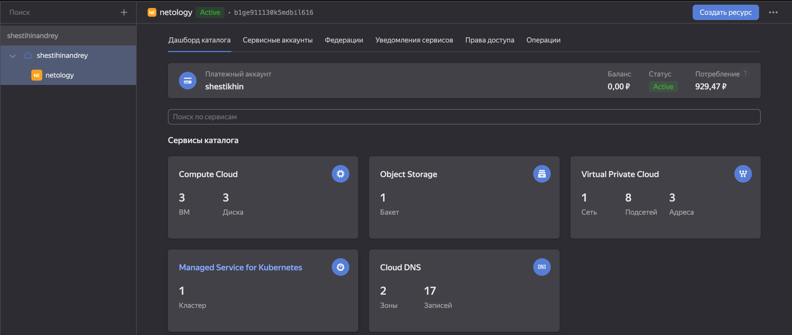
</p>

## 3. Создание тестового приложения

https://github.com/sisipka/nginx

## 4. Подготовка cистемы мониторинга и деплой приложения

- Деплой nginx

```bash
helm install nginx helm_nginx
```
```bash
andreyshestikhin@MacBook-Air-Andrey diploma-devops-engineer % helm install nginx helm_nginx
WARNING: Kubernetes configuration file is group-readable. This is insecure. Location: /Users/andreyshestikhin/.kube/config
NAME: nginx
LAST DEPLOYED: Sun Mar 26 11:21:11 2023
NAMESPACE: default
STATUS: deployed
REVISION: 1
TEST SUITE: None
andreyshestikhin@MacBook-Air-Andrey diploma-devops-engineer % helm list
WARNING: Kubernetes configuration file is group-readable. This is insecure. Location: /Users/andreyshestikhin/.kube/config
NAME    NAMESPACE       REVISION        UPDATED                                 STATUS          CHART                   APP VERSION
nginx   default         1               2023-03-26 11:21:11.759235 +0300 MSK    deployed        App-HelmChart-0.1.0     1.2.3      
andreyshestikhin@MacBook-Air-Andrey diploma-devops-engineer % kubectl get pod
NAME                                READY   STATUS              RESTARTS   AGE
nginx-deployment-565d97dd77-2whdz   0/1     ContainerCreating   0          52s
nginx-deployment-565d97dd77-72zs8   1/1     Running             0          52s
andreyshestikhin@MacBook-Air-Andrey diploma-devops-engineer % kubectl get svc
NAME            TYPE           CLUSTER-IP      EXTERNAL-IP      PORT(S)        AGE
kubernetes      ClusterIP      10.96.128.1     <none>           443/TCP        23m
nginx-service   LoadBalancer   10.96.167.112   84.201.147.233   80:30804/TCP   85s
```
<p align="left">
  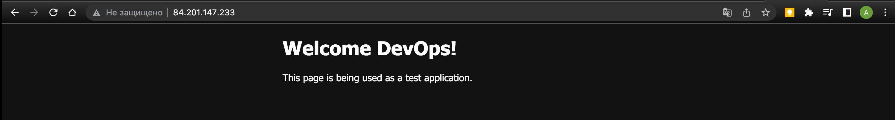
</p>

- В `stable/prometheus-operator` включена Grafana с набором готовых дашборд и набор ServiceMonitors для сбора метрик с сервисов кластера, таких как CoreDNS, API Server, Scheduler, etc:

```bash
git clone https://github.com/prometheus-operator/kube-prometheus.git
cd kube-prometheus
kubectl create ns monitoring
kubectl apply --server-side -f manifests/setup
kubectl wait \
	--for condition=Established \
	--all CustomResourceDefinition \
	--namespace=monitoring
kubectl apply -f manifests/
```

```bash
andreyshestikhin@MacBook-Air-Andrey ~ % git clone https://github.com/prometheus-operator/kube-prometheus.git
Cloning into 'kube-prometheus'...
remote: Enumerating objects: 17767, done.
remote: Counting objects: 100% (86/86), done.
remote: Compressing objects: 100% (66/66), done.
remote: Total 17767 (delta 36), reused 40 (delta 15), pack-reused 17681
Receiving objects: 100% (17767/17767), 9.39 MiB | 717.00 KiB/s, done.
Resolving deltas: 100% (11735/11735), done.
andreyshestikhin@MacBook-Air-Andrey ~ % cd kube-prometheus
kubectl create ns monitoring
namespace/monitoring created
andreyshestikhin@MacBook-Air-Andrey kube-prometheus % kubectl apply --server-side -f manifests/setup
customresourcedefinition.apiextensions.k8s.io/alertmanagerconfigs.monitoring.coreos.com serverside-applied
customresourcedefinition.apiextensions.k8s.io/alertmanagers.monitoring.coreos.com serverside-applied
customresourcedefinition.apiextensions.k8s.io/podmonitors.monitoring.coreos.com serverside-applied
customresourcedefinition.apiextensions.k8s.io/probes.monitoring.coreos.com serverside-applied
customresourcedefinition.apiextensions.k8s.io/prometheuses.monitoring.coreos.com serverside-applied
customresourcedefinition.apiextensions.k8s.io/prometheusrules.monitoring.coreos.com serverside-applied
customresourcedefinition.apiextensions.k8s.io/servicemonitors.monitoring.coreos.com serverside-applied
customresourcedefinition.apiextensions.k8s.io/thanosrulers.monitoring.coreos.com serverside-applied
namespace/monitoring serverside-applied
andreyshestikhin@MacBook-Air-Andrey kubectl apply -f manifests/

...

alertmanager.monitoring.coreos.com/main created
networkpolicy.networking.k8s.io/alertmanager-main created
poddisruptionbudget.policy/alertmanager-main created
prometheusrule.monitoring.coreos.com/alertmanager-main-rules created
secret/alertmanager-main created
service/alertmanager-main created
serviceaccount/alertmanager-main created
servicemonitor.monitoring.coreos.com/alertmanager-main created
clusterrole.rbac.authorization.k8s.io/blackbox-exporter created
clusterrolebinding.rbac.authorization.k8s.io/blackbox-exporter created
configmap/blackbox-exporter-configuration created
deployment.apps/blackbox-exporter created
networkpolicy.networking.k8s.io/blackbox-exporter created
service/blackbox-exporter created
serviceaccount/blackbox-exporter created
servicemonitor.monitoring.coreos.com/blackbox-exporter created
secret/grafana-config created
secret/grafana-datasources created
configmap/grafana-dashboard-alertmanager-overview created
configmap/grafana-dashboard-apiserver created
configmap/grafana-dashboard-cluster-total created
configmap/grafana-dashboard-controller-manager created
configmap/grafana-dashboard-grafana-overview created
configmap/grafana-dashboard-k8s-resources-cluster created
configmap/grafana-dashboard-k8s-resources-namespace created
configmap/grafana-dashboard-k8s-resources-node created
configmap/grafana-dashboard-k8s-resources-pod created
configmap/grafana-dashboard-k8s-resources-workload created
configmap/grafana-dashboard-k8s-resources-workloads-namespace created
configmap/grafana-dashboard-kubelet created
configmap/grafana-dashboard-namespace-by-pod created
configmap/grafana-dashboard-namespace-by-workload created
configmap/grafana-dashboard-node-cluster-rsrc-use created
configmap/grafana-dashboard-node-rsrc-use created
configmap/grafana-dashboard-nodes-darwin created
configmap/grafana-dashboard-nodes created
configmap/grafana-dashboard-persistentvolumesusage created
configmap/grafana-dashboard-pod-total created
configmap/grafana-dashboard-prometheus-remote-write created
configmap/grafana-dashboard-prometheus created
configmap/grafana-dashboard-proxy created
configmap/grafana-dashboard-scheduler created
configmap/grafana-dashboard-workload-total created
configmap/grafana-dashboards created
deployment.apps/grafana created
networkpolicy.networking.k8s.io/grafana created
prometheusrule.monitoring.coreos.com/grafana-rules created
service/grafana created
serviceaccount/grafana created
servicemonitor.monitoring.coreos.com/grafana created
prometheusrule.monitoring.coreos.com/kube-prometheus-rules created
clusterrole.rbac.authorization.k8s.io/kube-state-metrics created
clusterrolebinding.rbac.authorization.k8s.io/kube-state-metrics created
deployment.apps/kube-state-metrics created
networkpolicy.networking.k8s.io/kube-state-metrics created
prometheusrule.monitoring.coreos.com/kube-state-metrics-rules created
service/kube-state-metrics created
serviceaccount/kube-state-metrics created
servicemonitor.monitoring.coreos.com/kube-state-metrics created
prometheusrule.monitoring.coreos.com/kubernetes-monitoring-rules created
servicemonitor.monitoring.coreos.com/kube-apiserver created
servicemonitor.monitoring.coreos.com/coredns created
servicemonitor.monitoring.coreos.com/kube-controller-manager created
servicemonitor.monitoring.coreos.com/kube-scheduler created
servicemonitor.monitoring.coreos.com/kubelet created
clusterrole.rbac.authorization.k8s.io/node-exporter created
clusterrolebinding.rbac.authorization.k8s.io/node-exporter created
daemonset.apps/node-exporter created
networkpolicy.networking.k8s.io/node-exporter created
prometheusrule.monitoring.coreos.com/node-exporter-rules created
service/node-exporter created
serviceaccount/node-exporter created
servicemonitor.monitoring.coreos.com/node-exporter created
clusterrole.rbac.authorization.k8s.io/prometheus-k8s created
clusterrolebinding.rbac.authorization.k8s.io/prometheus-k8s created
networkpolicy.networking.k8s.io/prometheus-k8s created
poddisruptionbudget.policy/prometheus-k8s created
prometheus.monitoring.coreos.com/k8s created
prometheusrule.monitoring.coreos.com/prometheus-k8s-prometheus-rules created
rolebinding.rbac.authorization.k8s.io/prometheus-k8s-config created
rolebinding.rbac.authorization.k8s.io/prometheus-k8s created
rolebinding.rbac.authorization.k8s.io/prometheus-k8s created
rolebinding.rbac.authorization.k8s.io/prometheus-k8s created
role.rbac.authorization.k8s.io/prometheus-k8s-config created
role.rbac.authorization.k8s.io/prometheus-k8s created
role.rbac.authorization.k8s.io/prometheus-k8s created
role.rbac.authorization.k8s.io/prometheus-k8s created
service/prometheus-k8s created
serviceaccount/prometheus-k8s created
servicemonitor.monitoring.coreos.com/prometheus-k8s created
apiservice.apiregistration.k8s.io/v1beta1.metrics.k8s.io configured
clusterrole.rbac.authorization.k8s.io/prometheus-adapter created
clusterrole.rbac.authorization.k8s.io/system:aggregated-metrics-reader created
clusterrolebinding.rbac.authorization.k8s.io/prometheus-adapter created
clusterrolebinding.rbac.authorization.k8s.io/resource-metrics:system:auth-delegator created
clusterrole.rbac.authorization.k8s.io/resource-metrics-server-resources created
configmap/adapter-config created
deployment.apps/prometheus-adapter created
networkpolicy.networking.k8s.io/prometheus-adapter created
poddisruptionbudget.policy/prometheus-adapter created
rolebinding.rbac.authorization.k8s.io/resource-metrics-auth-reader created
service/prometheus-adapter created
serviceaccount/prometheus-adapter created
servicemonitor.monitoring.coreos.com/prometheus-adapter created
clusterrole.rbac.authorization.k8s.io/prometheus-operator created
clusterrolebinding.rbac.authorization.k8s.io/prometheus-operator created
deployment.apps/prometheus-operator created
networkpolicy.networking.k8s.io/prometheus-operator created
prometheusrule.monitoring.coreos.com/prometheus-operator-rules created
service/prometheus-operator created
serviceaccount/prometheus-operator created
servicemonitor.monitoring.coreos.com/prometheus-operator created
andreyshestikhin@MacBook-Air-Andrey kube-prometheus % kubectl get pod -n monitoring
NAME                                   READY   STATUS    RESTARTS        AGE
alertmanager-main-0                    2/2     Running   0               6m2s
alertmanager-main-1                    2/2     Running   0               6m2s
alertmanager-main-2                    2/2     Running   1 (4m27s ago)   6m2s
blackbox-exporter-cbb9c96b-dlg8g       3/3     Running   0               11m
grafana-7d75c7d4c-zr2wh                1/1     Running   0               10m
kube-state-metrics-755468477b-j7s7j    3/3     Running   0               10m
node-exporter-9h9rk                    2/2     Running   0               10m
node-exporter-j85br                    2/2     Running   0               10m
node-exporter-mpjmb                    2/2     Running   0               3m16s
node-exporter-pw9v7                    2/2     Running   0               10m
prometheus-adapter-54bdfd5865-flh7v    1/1     Running   0               10m
prometheus-adapter-54bdfd5865-g5757    1/1     Running   0               10m
prometheus-k8s-0                       2/2     Running   0               5m48s
prometheus-k8s-1                       2/2     Running   0               5m48s
prometheus-operator-6d8d949fcf-6nbxx   2/2     Running   0               10m
andreyshestikhin@MacBook-Air-Andrey kube-prometheus % kubectl get svc -n monitoring
NAME                    TYPE        CLUSTER-IP      EXTERNAL-IP   PORT(S)                      AGE
alertmanager-main       ClusterIP   10.96.200.203   <none>        9093/TCP,8080/TCP            11m
alertmanager-operated   ClusterIP   None            <none>        9093/TCP,9094/TCP,9094/UDP   6m15s
blackbox-exporter       ClusterIP   10.96.166.190   <none>        9115/TCP,19115/TCP           11m
grafana                 ClusterIP   10.96.238.75    <none>        3000/TCP                     10m
kube-state-metrics      ClusterIP   None            <none>        8443/TCP,9443/TCP            10m
node-exporter           ClusterIP   None            <none>        9100/TCP                     10m
prometheus-adapter      ClusterIP   10.96.221.118   <none>        443/TCP                      10m
prometheus-k8s          ClusterIP   10.96.248.219   <none>        9090/TCP,8080/TCP            10m
prometheus-operated     ClusterIP   None            <none>        9090/TCP                     6m1s
prometheus-operator     ClusterIP   None            <none>        8443/TCP                     10m
```

**Доступ к интерфейсам**

**Prometheus**
```bash
$ kubectl --namespace monitoring port-forward svc/prometheus-k8s 9090
```
Then access via http://localhost:9090

**Grafana**
```bash
$ kubectl --namespace monitoring port-forward --address 0.0.0.0 svc/grafana 3000
```
Then access via http://localhost:3000 and use the default grafana user:password of admin:admin.

**Alert Manager**
```bash
$ kubectl --namespace monitoring port-forward svc/alertmanager-main 9093
```
Then access via http://localhost:9093

<p align="left">
  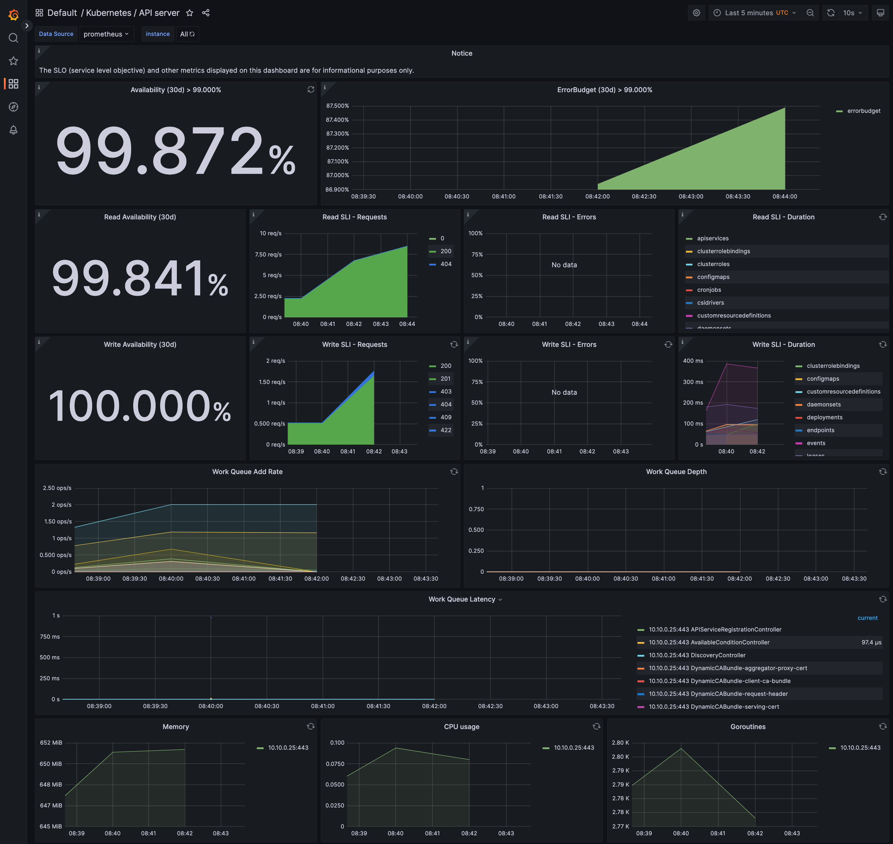
</p>

- **Установка Atlantis:**

1. helm repo add runatlantis https://runatlantis.github.io/helm-charts


## 5. Установка и настройка CI/CD

- **Устанавливаем Jenkins**

```bash
andreyshestikhin@MacBook-Air-Andrey ci_cd % kubectl create ns jenkins
namespace/jenkins created
andreyshestikhin@MacBook-Air-Andrey ci_cd % helm install jenkins --namespace jenkins bitnami/jenkins
WARNING: Kubernetes configuration file is group-readable. This is insecure. Location: /Users/andreyshestikhin/.kube/config
NAME: jenkins
LAST DEPLOYED: Fri Mar 31 15:40:49 2023
NAMESPACE: jenkins
STATUS: deployed
REVISION: 1
TEST SUITE: None
NOTES:
CHART NAME: jenkins
CHART VERSION: 12.0.0
APP VERSION: 2.375.3

** Please be patient while the chart is being deployed **

1. Get the Jenkins URL by running:

** Please ensure an external IP is associated to the jenkins service before proceeding **
** Watch the status using: kubectl get svc --namespace jenkins -w jenkins **

  export SERVICE_IP=$(kubectl get svc --namespace jenkins jenkins --template "{{ range (index .status.loadBalancer.ingress 0) }}{{ . }}{{ end }}")
  echo "Jenkins URL: http://$SERVICE_IP/"

2. Login with the following credentials

  echo Username: user
  echo Password: $(kubectl get secret --namespace jenkins jenkins -o jsonpath="{.data.jenkins-password}" | base64 -d)
  
andreyshestikhin@MacBook-Air-Andrey ci_cd % kubectl get po -n jenkins
NAME                       READY   STATUS    RESTARTS   AGE
jenkins-59445b5d6c-vf48g   1/1     Running   0          4m40s
andreyshestikhin@MacBook-Air-Andrey ci_cd % kubectl get svc -n jenkins
NAME      TYPE           CLUSTER-IP      EXTERNAL-IP      PORT(S)                      AGE
jenkins   LoadBalancer   10.96.242.191   84.201.145.226   80:30114/TCP,443:31660/TCP   4m46s
  ```

Для корректной работы скриптов автоматического деплоя понадобится дать разришение cluster-admin для Jenkins для получения списка ресурсов в kubernetes и манипулирвоания с ними.

```bash
andreyshestikhin@MacBook-Air-Andrey ~ % kubectl -n jenkins create sa jenkins
serviceaccount/jenkins created
andreyshestikhin@MacBook-Air-Andrey ci_cd % kubectl create clusterrolebinding jenkins --clusterrole cluster-admin --serviceaccount=jenkins:jenkins
clusterrolebinding.rbac.authorization.k8s.io/jenkins created
```

<p align="left">
  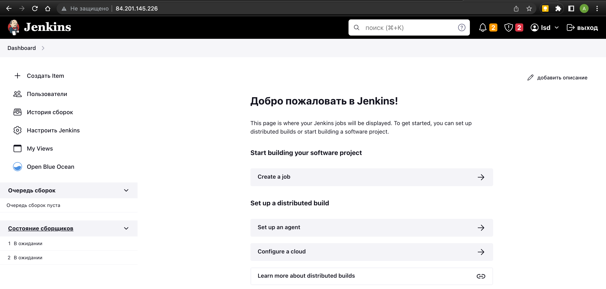
</p>

Настраиваем Pipeline:

<p align="left">
  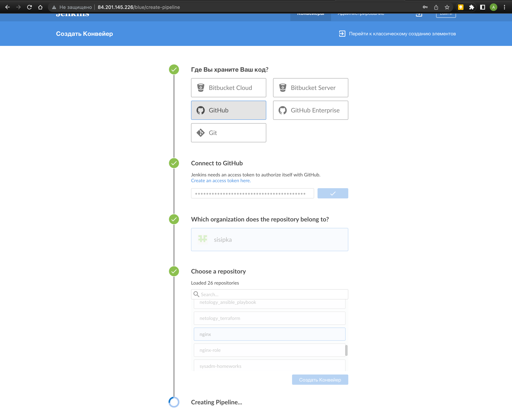
</p>

Прописываем webhook:

<p align="left">
  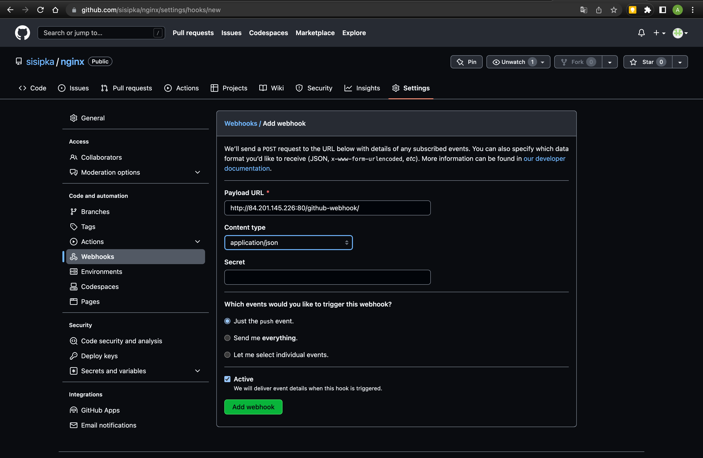
</p>

<p align="left">
  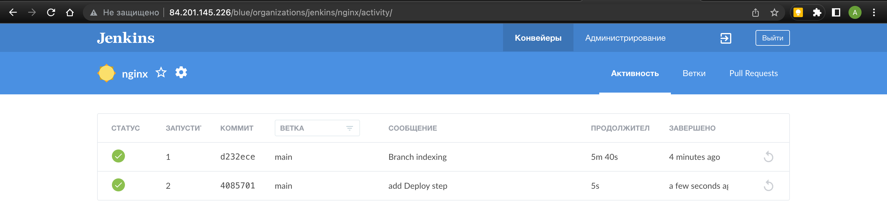
</p>

- **Настраиваем Jenkins для Build, Test, Push (Docker Hub) и разворачивания контейнера в кластере Kubernetes**

Для  предоставления динамических агентов нужно поставить [плагин Kubernetes](https://plugins.jenkins.io/kubernetes/)

<p align="left">
  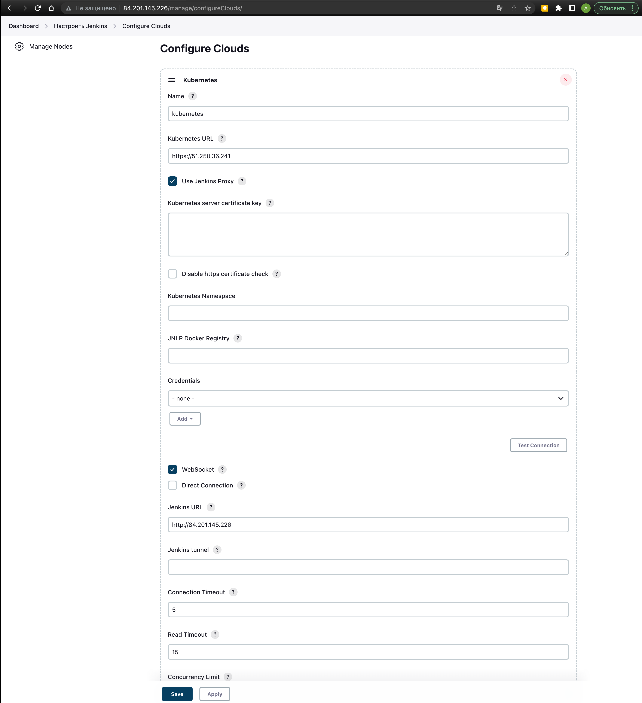
</p>

Добавить учетные данные для dockerhub:

<p align="left">
  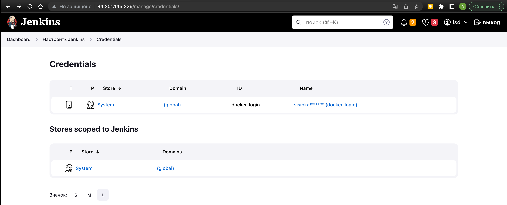
</p>

Создаем диаграмму Helm для приложения `helm_nginx`.

```bash
helm install nginx-app /helm_nginx -n jenkins
```

**CI/CD настроен:**

1. Делаем коммит "presentation" в github:

<p align="left">
  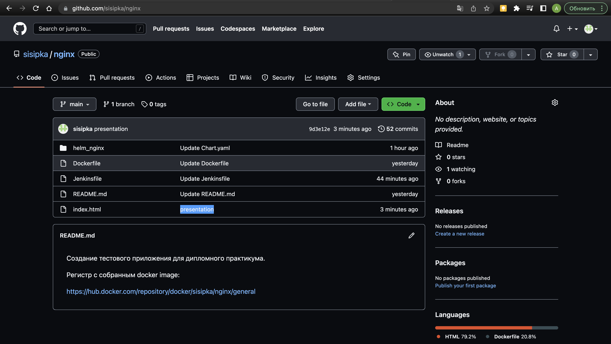
</p>

2. Jenkins по commmit запускает наш pipeline:

<p align="left">
  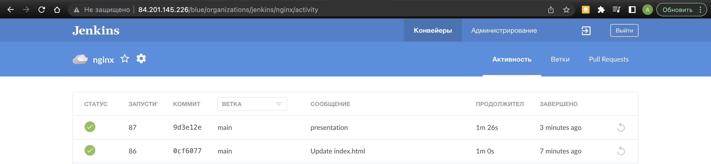
</p>

<p align="left">
  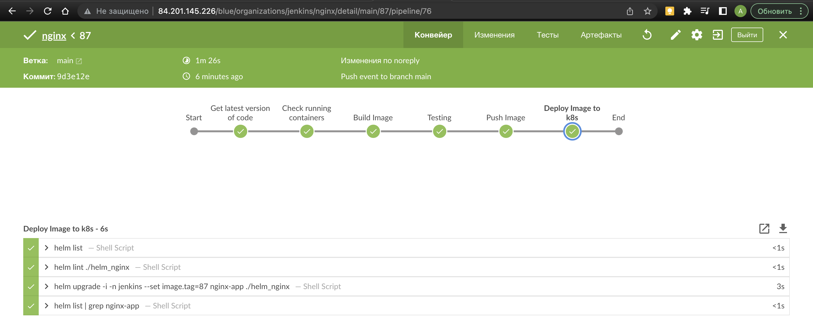
</p>

3. Jenkins отправляет image в dockerhub:

<p align="left">
  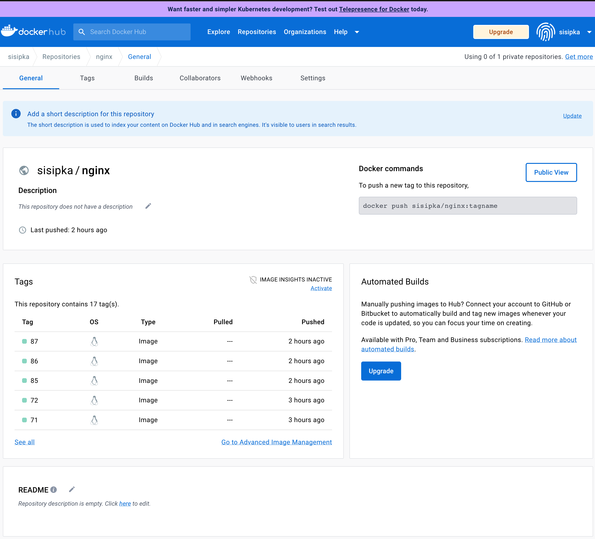
</p>

4. Разворачивает image nginx в kubernetes:

```bash
andreyshestikhin@MacBook-Air-Andrey ~ % kubectl get svc -n jenkins
NAME                TYPE           CLUSTER-IP      EXTERNAL-IP      PORT(S)                      AGE
jenkins             LoadBalancer   10.96.242.191   84.201.145.226   80:30114/TCP,443:31660/TCP   47h
nginx-app-service   LoadBalancer   10.96.186.113   84.201.146.107   80:32164/TCP                 91m
andreyshestikhin@MacBook-Air-Andrey ~ % kubectl get pod -n jenkins
NAME                                    READY   STATUS    RESTARTS   AGE
jenkins-59445b5d6c-vf48g                1/1     Running   0          47h
nginx-app-deployment-7955bfd8b5-26njw   1/1     Running   0          91m
nginx-app-deployment-7955bfd8b5-j9stp   1/1     Running   0          91m
```

<p align="left">
  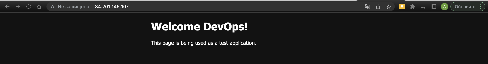
</p>